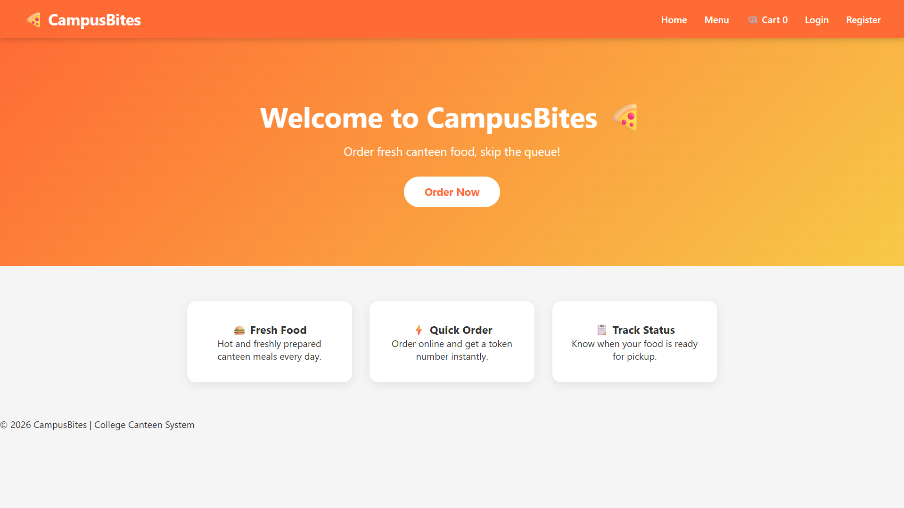
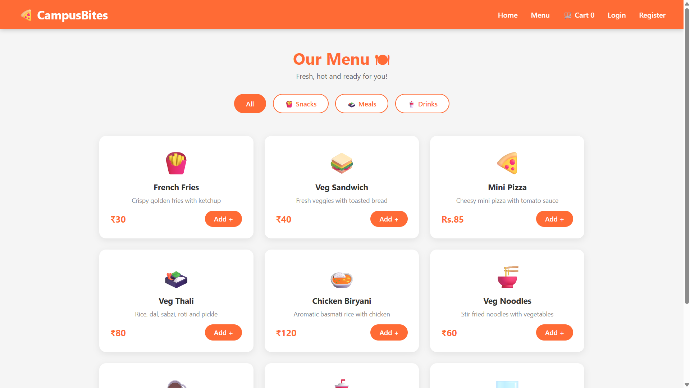
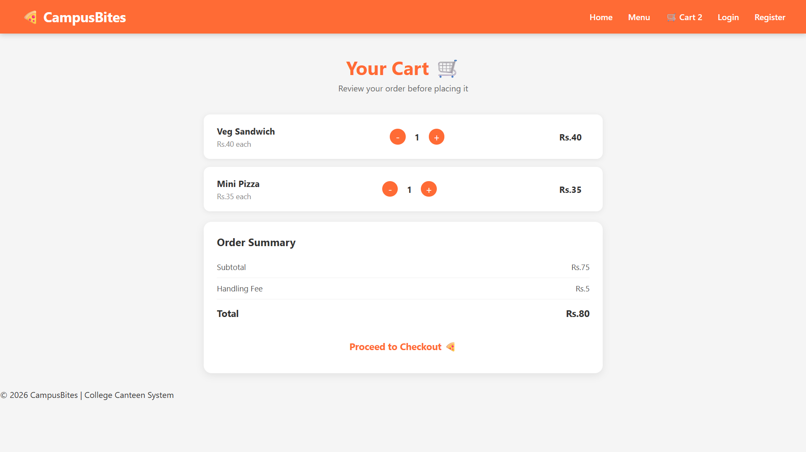
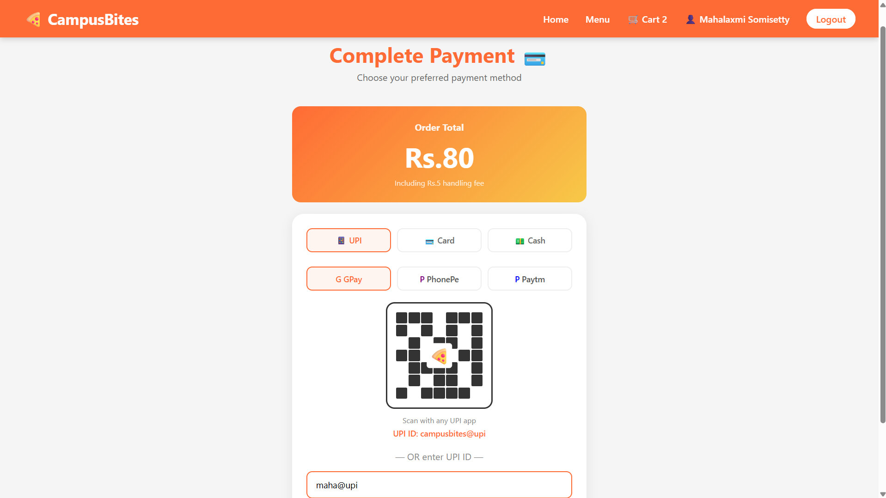
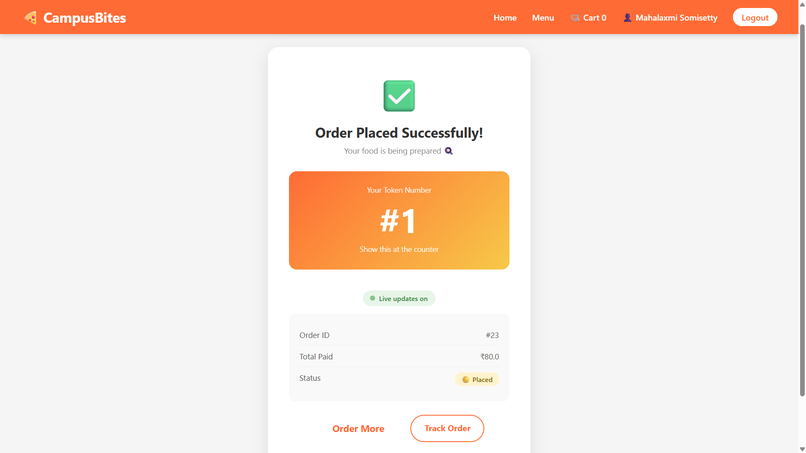
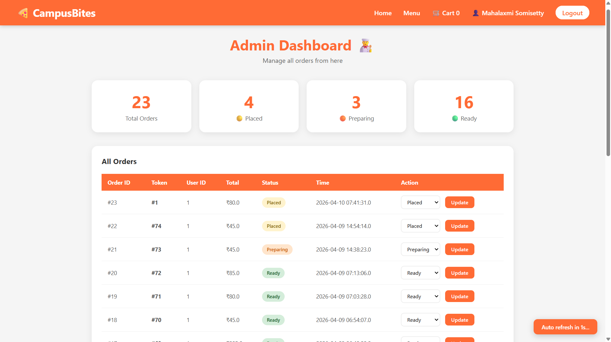
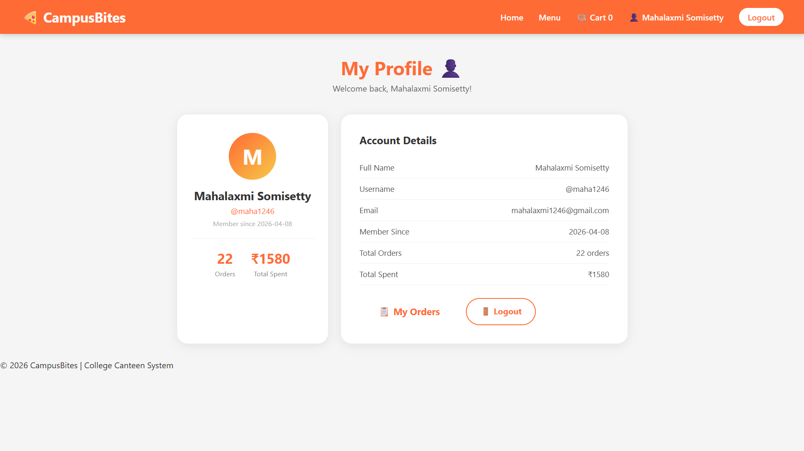
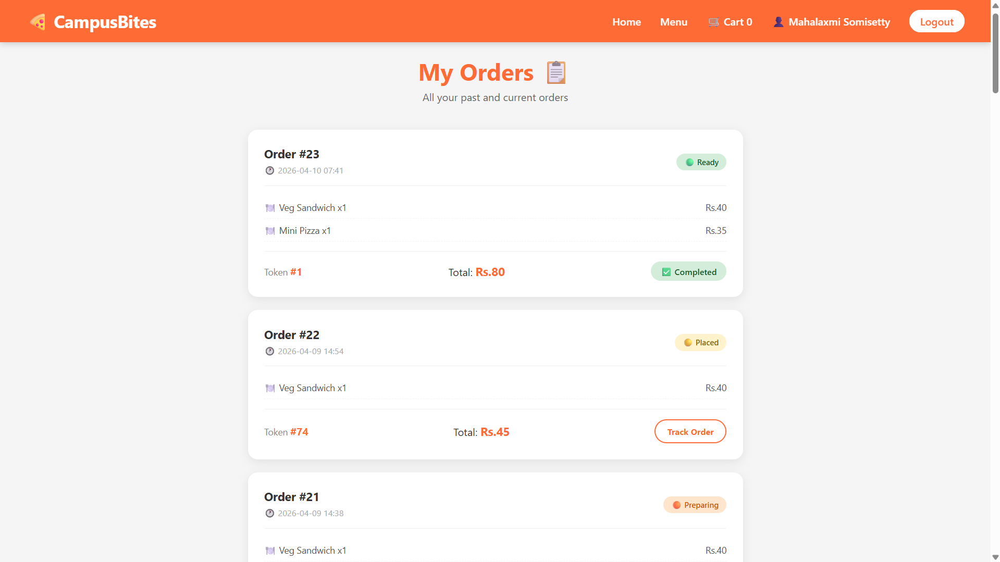

# 🍕 CampusBites - College Canteen Food Ordering System


> A full-stack college canteen food ordering system where students can browse the menu, add items to cart, pay via UPI, get a token number and track their order in real-time — without standing in queue!

---

## 📸 Screenshots

### 🏠 Home Page


### 🍔 Menu Page


### 🛒 Cart Page


### 💳 Payment Page


### 📋 Order Status (Real-time)


### 👨‍🍳 Admin Dashboard


### 👤 Profile Page


### 📋 Order History


---

## 🌟 Features

### 👤 User Features
- ✅ Register & Login with session management
- ✅ Browse menu with category filters (Snacks, Meals, Drinks)
- ✅ Add items to cart with quantity control
- ✅ Dummy UPI / Card / Cash payment
- ✅ Real-time order status tracking (auto updates every 3 seconds!)
- ✅ Unique token number for each order
- ✅ Queue position — see how many orders are ahead of you
- ✅ Order history — view all past orders
- ✅ Profile page with total orders and spending stats
- ✅ Browser notifications when order is ready

### 👨‍🍳 Admin Features
- ✅ Admin dashboard with live order stats
- ✅ View all orders with status badges
- ✅ Update order status (Placed → Preparing → Ready)
- ✅ Auto refreshes every 5 seconds
- ✅ Total orders, placed, preparing, ready counts

---

## 🛠️ Tech Stack

| Layer | Technology |
|---|---|
| Frontend | HTML, CSS, JavaScript |
| Backend | Java Servlets, JSP |
| Database | MySQL |
| Server | Apache Tomcat 9.0 |
| IDE | Eclipse Enterprise Edition |
| Real-time | HTTP Polling (every 3s) |

---

## ⚙️ Prerequisites

Make sure you have all of these installed before running the project:

| Tool | Version | Download Link |
|---|---|---|
| Java JDK | 11 or higher | https://www.oracle.com/java/technologies/downloads/ |
| Eclipse IDE | Enterprise Edition | https://www.eclipse.org/downloads/ |
| Apache Tomcat | 9.0 | https://tomcat.apache.org/download-90.cgi |
| MySQL | 8.0 | https://dev.mysql.com/downloads/installer/ |
| MySQL Workbench | Latest | Included with MySQL installer |
| Git | Latest | https://git-scm.com/download/win |

---

## 🗄️ Step 1 — Database Setup

### 1.1 Open MySQL Workbench and run this SQL:

```sql
CREATE DATABASE campusbites;
USE campusbites;

CREATE TABLE users (
    id INT AUTO_INCREMENT PRIMARY KEY,
    fullname VARCHAR(100) NOT NULL,
    username VARCHAR(50) UNIQUE NOT NULL,
    email VARCHAR(100) UNIQUE NOT NULL,
    password VARCHAR(255) NOT NULL,
    created_at TIMESTAMP DEFAULT CURRENT_TIMESTAMP
);

CREATE TABLE menu_items (
    id INT AUTO_INCREMENT PRIMARY KEY,
    name VARCHAR(100) NOT NULL,
    description VARCHAR(255),
    price DECIMAL(10,2) NOT NULL,
    category VARCHAR(50),
    available BOOLEAN DEFAULT TRUE
);

CREATE TABLE orders (
    id INT AUTO_INCREMENT PRIMARY KEY,
    user_id INT,
    total_amount DECIMAL(10,2),
    status VARCHAR(50) DEFAULT 'Placed',
    token_number INT,
    created_at TIMESTAMP DEFAULT CURRENT_TIMESTAMP,
    FOREIGN KEY (user_id) REFERENCES users(id)
);

CREATE TABLE order_items (
    id INT AUTO_INCREMENT PRIMARY KEY,
    order_id INT,
    item_name VARCHAR(100),
    price DECIMAL(10,2),
    quantity INT,
    FOREIGN KEY (order_id) REFERENCES orders(id)
);

INSERT INTO menu_items (name, description, price, category) VALUES
('French Fries', 'Crispy golden fries with ketchup', 30, 'snacks'),
('Veg Sandwich', 'Fresh veggies with toasted bread', 40, 'snacks'),
('Mini Pizza', 'Cheesy mini pizza with tomato sauce', 35, 'snacks'),
('Veg Thali', 'Rice, dal, sabzi, roti and pickle', 80, 'meals'),
('Chicken Biryani', 'Aromatic basmati rice with chicken', 120, 'meals'),
('Veg Noodles', 'Stir fried noodles with vegetables', 60, 'meals'),
('Tea', 'Hot masala chai', 10, 'drinks'),
('Cold Coffee', 'Chilled coffee with milk and ice', 40, 'drinks'),
('Juice', 'Fresh seasonal fruit juice', 30, 'drinks');
```

### 1.2 Update your MySQL password in the project

Open this file:
```
src/main/java/com/campusbites/DBConnection.java
```

Find this line and replace with your MySQL root password:
```java
private static final String PASSWORD = "YOUR_MYSQL_PASSWORD";
```

---

## 🚀 Step 2 — Project Setup in Eclipse

### 2.1 Clone the repository

Open Command Prompt and run:
```
git clone https://github.com/mahalaxmi246/CampusBites.git
```

### 2.2 Import into Eclipse

1. Open **Eclipse Enterprise Edition**
2. Go to **File → Import**
3. Select **General → Existing Projects into Workspace**
4. Click **Browse** and select the cloned **CampusBites** folder
5. Click **Finish**

### 2.3 Add required JAR files

Download these 2 JAR files:

**JAR 1 — MySQL Connector:**
- Go to: https://dev.mysql.com/downloads/connector/j/
- Select Platform Independent → Download ZIP
- Extract and find `mysql-connector-j-9.6.0.jar`

**JAR 2 — JSON Library:**
- Download directly: https://repo1.maven.org/maven2/org/json/json/20240303/json-20240303.jar

**Add both JARs to project:**
1. Copy both JAR files
2. Paste into: `src/main/webapp/WEB-INF/lib/`
3. In Eclipse, right click each JAR
4. Select **Build Path → Add to Build Path**

---

## ⚙️ Step 3 — Configure Tomcat in Eclipse

### 3.1 Add Tomcat Server

1. Go to **Window → Preferences**
2. Expand **Server → Runtime Environments**
3. Click **Add**
4. Select **Apache Tomcat v9.0**
5. Click **Next**
6. Click **Browse** and select your Tomcat installation folder
   - Usually: `C:\Program Files\Apache Software Foundation\Tomcat 9.0`
7. Click **Finish**

### 3.2 Change Server Location (IMPORTANT!)

1. Go to **Window → Show View → Servers**
2. Double click **Tomcat v9.0**
3. Click **Stop** first if running
4. Under **Server Locations** select **Use Tomcat installation**
5. Save **(Ctrl+S)**

### 3.3 Add project to Tomcat

1. Right click **Tomcat v9.0** in Servers tab
2. Click **Add and Remove**
3. Move **CampusBites** to Configured side
4. Click **Finish**

---

## ▶️ Step 4 — Run the Project

1. Right click **Tomcat v9.0** in Servers tab
2. Click **Start**
3. Wait for "Server started" message in Console
4. Open browser and go to:

```
http://localhost:8080/CampusBites/index.jsp
```

---

## 📱 Step 5 — How to Use

### As a Student:
1. Go to `http://localhost:8080/CampusBites/index.jsp`
2. Click **Register** and create your account
3. Login with your credentials
4. Browse **Menu** and add items to cart
5. Click **Proceed to Checkout**
6. Choose payment method (UPI / Card / Cash)
7. Get your **Token Number**
8. Track your order status in real-time!
9. Collect food from counter when status shows **Ready** ✅

### As Admin:
1. Go to `http://localhost:8080/CampusBites/admin.jsp`
2. View all incoming orders in real-time
3. Update order status using the dropdown
4. Dashboard auto-refreshes every 5 seconds!

---

## 📁 Project Structure

```
CampusBites/
├── src/
│   └── main/
│       ├── java/
│       │   └── com/campusbites/
│       │       ├── DBConnection.java
│       │       ├── RegisterServlet.java
│       │       ├── LoginServlet.java
│       │       ├── LogoutServlet.java
│       │       ├── OrderServlet.java
│       │       ├── UpdateOrderServlet.java
│       │       └── GetOrderStatusServlet.java
│       └── webapp/
│           ├── css/style.css
│           ├── js/cart.js
│           ├── index.jsp
│           ├── menu.jsp
│           ├── cart.jsp
│           ├── Login.jsp
│           ├── register.html
│           ├── navbar.jsp
│           ├── profile.jsp
│           ├── payment.jsp
│           ├── order-confirmation.jsp
│           ├── order-status.jsp
│           ├── order-history.jsp
│           ├── admin.jsp
│           └── WEB-INF/
│               ├── lib/
│               │   ├── mysql-connector-j-9.6.0.jar
│               │   └── json-20240303.jar
│               └── web.xml
├── screenshots/
└── pom.xml
```

---

## 🔧 Common Issues & Fixes

### ❌ Issue 1 — HTTP 404 Not Found
**Fix:** Right click Tomcat → Clean → Run As → Run on Server

### ❌ Issue 2 — Database Connection Error
**Fix:** Check password in `DBConnection.java` matches your MySQL root password. Also make sure MySQL service is running (search "Services" in Windows → Start MySQL80)

### ❌ Issue 3 — Port 8080 Already in Use
**Fix:** Double click Tomcat → Change port to 8081 → Access via `http://localhost:8081/CampusBites/index.jsp`

### ❌ Issue 4 — Server Location Greyed Out
**Fix:** Stop Tomcat → Remove project → Change location → Re-add project → Start

### ❌ Issue 5 — JAR Not Found
**Fix:** Right click JAR → Build Path → Add to Build Path

### ❌ Issue 6 — Emojis Showing as Boxes
**Fix:** Window → Preferences → General → Workspace → Set encoding to UTF-8 → Restart Tomcat

---

## 🏗️ System Design

```
Student Browser (HTML + CSS + JS)
         |
         | HTTP Request
         v
Apache Tomcat 9.0 (Port 8080)
    |              |
 Servlets       JSP Pages
 (Logic)     (Presentation)
         |
         | JDBC
         v
    MySQL Database
 users | menu_items | orders | order_items

Real-time: Browser polls every 3 seconds
Admin: Auto-refreshes every 5 seconds
```

---

## 📄 Academic Info

This project covers the following weekly topics from the IT-R22 syllabus:

| Week | Topic | Implemented In |
|---|---|---|
| Week 1-2 | HTML + CSS | All pages styling |
| Week 3 | JavaScript Validation | register.html, Login.jsp |
| Week 4 | Shopping Cart | cart.jsp, cart.js |
| Week 8 | Servlet for data retrieval | GetOrderStatusServlet.java |
| Week 9 | User Authentication | LoginServlet, LogoutServlet |

---

## 👩‍💻 Developer

**Mahalaxmi Somisetty**
- GitHub: https://github.com/mahalaxmi246
- Project: CampusBites - College Canteen Food Ordering System
- College: VNRVJIET | IT - R22 | 2026

---

⭐ **If this helped you, give it a star on GitHub!**
